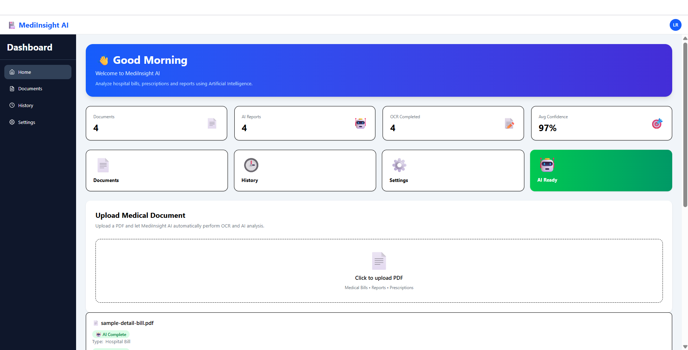
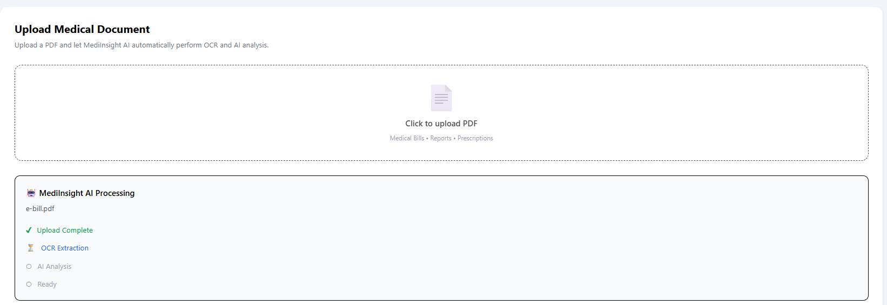
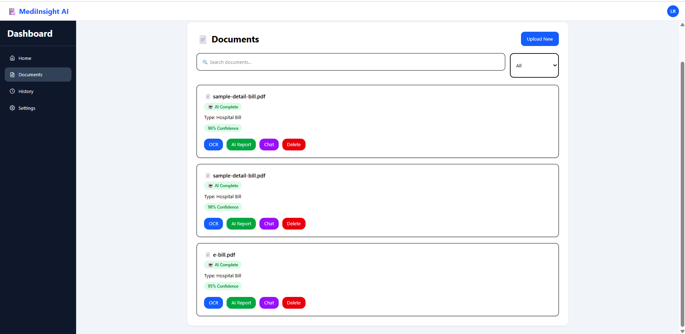
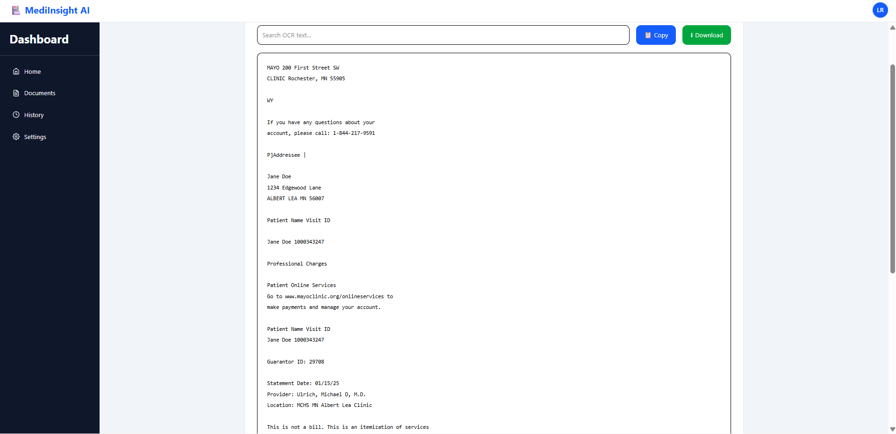
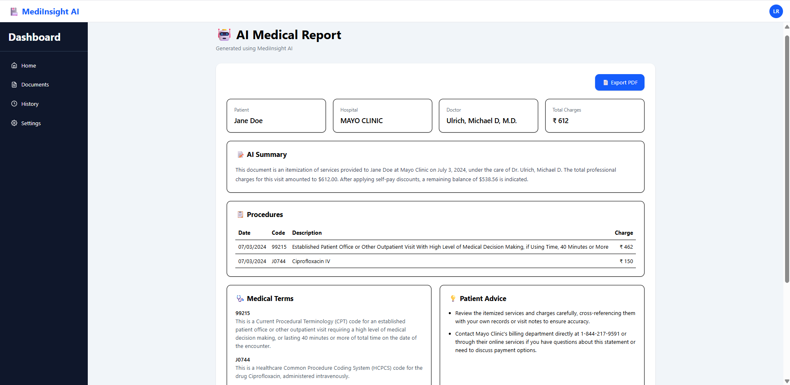
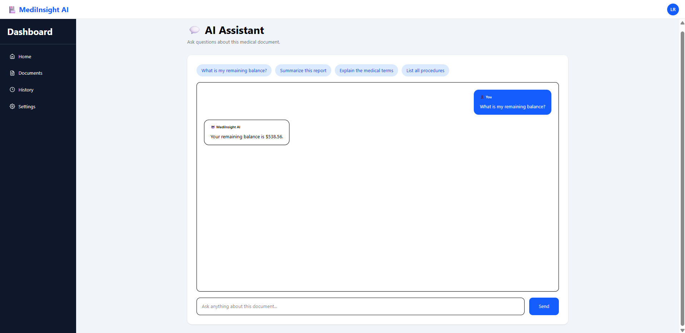
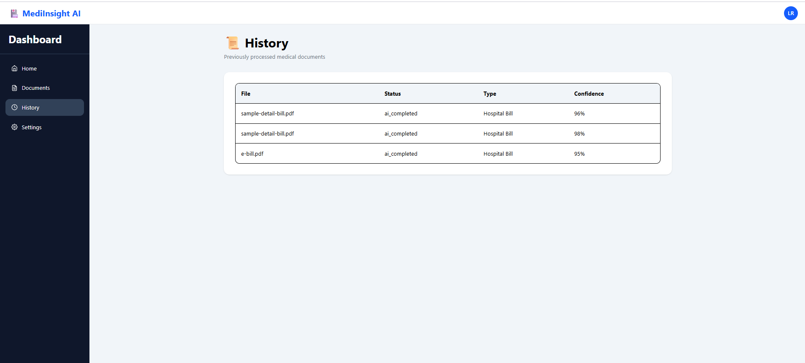
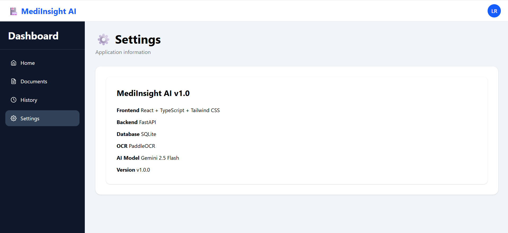

# 🏥 MediInsight AI

> An AI-powered medical document analysis platform that extracts, analyzes, summarizes, and enables intelligent interaction with medical documents using OCR and Large Language Models.

MediInsight AI transforms hospital bills, prescriptions, laboratory reports, discharge summaries, and other medical documents into structured, easy-to-understand information using **PaddleOCR** and **Google Gemini 2.5 Flash**.

---

# 🚀 Project Progress

```text
Backend         ████████████████████ 100%

Frontend        ███████████████████░ 95%

AI Integration  ████████████████████ 100%

OCR Pipeline    ████████████████████ 100%

Database        ████████████████████ 100%

Authentication  ░░░░░░░░░░░░░░░░░░░░   0%

Deployment      ░░░░░░░░░░░░░░░░░░░░   0%

Testing         ████████████████░░░░ 80%

Documentation   ██████████████████░░ 90%
```

---

# ✨ Features

## 📄 Document Processing

- Upload PDF medical documents
- Automatic OCR text extraction
- Structured document parsing
- Local document storage
- Document history

---

## 🤖 AI Analysis

- AI-generated medical summary
- Procedure extraction
- Medical terminology explanation
- Patient-friendly advice
- Suggested follow-up questions
- Confidence score
- Hospital information extraction
- Doctor information extraction
- Billing information extraction

---

## 💬 AI Assistant

- Ask questions about uploaded reports
- Context-aware document chat
- Explain medical terminology
- Answer billing-related questions
- Summarize reports

---

## 📊 Dashboard

- Dashboard statistics
- Upload workflow
- Processing status
- Confidence indicators
- Recent documents

---

## 📂 Document Management

- Search documents
- Filter documents
- Delete documents
- OCR Viewer
- AI Report Viewer
- Processing History

---

## 📑 Export

- Export AI report as PDF

---

# 🛠 Tech Stack

## Frontend

- React
- TypeScript
- Tailwind CSS
- React Router
- Axios
- React Hot Toast
- jsPDF

---

## Backend

- FastAPI
- SQLAlchemy
- SQLite
- Pydantic

---

## Artificial Intelligence

- Google Gemini 2.5 Flash
- PaddleOCR
- pdf2image
- Poppler
- Tesseract (optional support)

---

# 📸 Screenshots

## Dashboard



---

## Upload Workflow



---

## Documents



---

## OCR Result



---

## AI Medical Report



---

## AI Chat Assistant



---

## History



---

## Settings



---

# 🏗 System Architecture

```
                    React + TypeScript
                           │
                           ▼
                   FastAPI REST API
                           │
          ┌────────────────┼────────────────┐
          ▼                ▼                ▼
      SQLite DB       PaddleOCR      Gemini 2.5 Flash
          │                │                │
          └────────────┬───┴────────────────┘
                       ▼
                AI Medical Report
                       │
         ┌─────────────┼──────────────┐
         ▼             ▼              ▼
      OCR View     AI Chat      PDF Export
```

---

# 📁 Project Structure

```
MediInsight-AI

├── backend
│   ├── ai
│   ├── api
│   ├── database
│   ├── schemas
│   ├── services
│   ├── utils
│   ├── uploads
│   ├── extracted_text
│   ├── analysis
│   └── app.py
│
├── frontend
│   ├── components
│   ├── pages
│   ├── services
│   ├── types
│   ├── utils
│   └── assets
│
├── screenshots
│
├── README.md
├── requirements.txt
└── package.json
```

---

# ⚙️ Installation

## Clone Repository

```bash
git clone https://github.com/<your-username>/MediInsight-AI.git

cd MediInsight-AI
```

---

## Backend Setup

```bash
cd backend

python -m venv .venv

.venv\Scripts\activate

pip install -r requirements.txt

uvicorn backend.app.main:app --reload
```

Backend runs on

```
http://127.0.0.1:8000
```

Swagger

```
http://127.0.0.1:8000/docs
```

---

## Frontend Setup

```bash
cd frontend

npm install

npm run dev
```

Frontend

```
http://localhost:5173
```

---

# 📌 Version 1.0 Completed

- PDF Upload
- OCR Extraction
- AI Medical Report
- AI Chat
- Dashboard
- Document History
- Search & Filter
- PDF Export
- Medical Term Explanation
- Suggested Questions
- Responsive Dashboard Layout
- SQLite Integration

---

# 🗺 Roadmap

## Version 1.1

- User Authentication
- User Profiles
- Cloud Storage
- Mobile Responsive Improvements
- Dark Mode
- Better PDF Styling

---

## Version 1.2

- RAG-based Chat using Vector Database
- Semantic Search
- Medical Timeline
- Multiple Report Comparison
- Report Versioning
- Better AI Report Formatting

---

## Version 2.0

- Doctor Dashboard
- Patient Dashboard
- Appointment Integration
- Multi-language OCR
- DICOM Image Support
- Medical Image Analysis
- Voice Assistant
- Multi-user Workspace
- Hospital Integration APIs

---

# 🤝 Contributing

Contributions are welcome.

1. Fork the repository
2. Create a feature branch

```bash
git checkout -b feature-name
```

3. Commit changes

```bash
git commit -m "Add feature"
```

4. Push changes

```bash
git push origin feature-name
```

5. Open a Pull Request

---

# 👨‍💻 Author

**Lingam Roopesh**

B.Tech – Internet of Things

KL University

GitHub: https://github.com/roopesh431

LinkedIn: *(Add your LinkedIn profile URL here)*

---

# 📄 License

This project is released under the MIT License.

---

# ⭐ Support

If you found this project useful, please consider giving it a ⭐ on GitHub.

Feedback, suggestions, and contributions are always welcome.