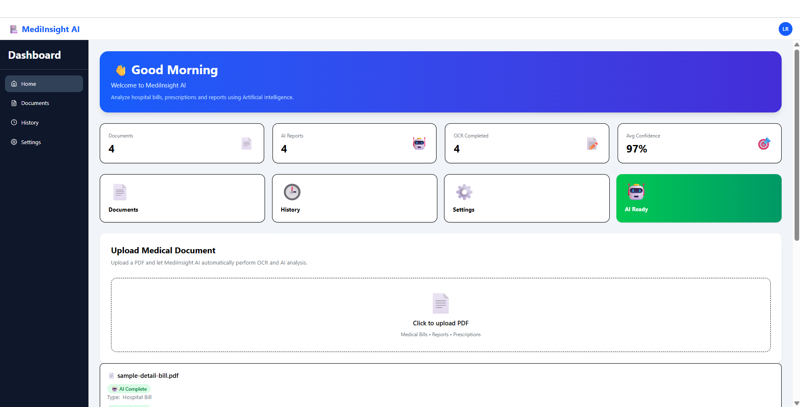
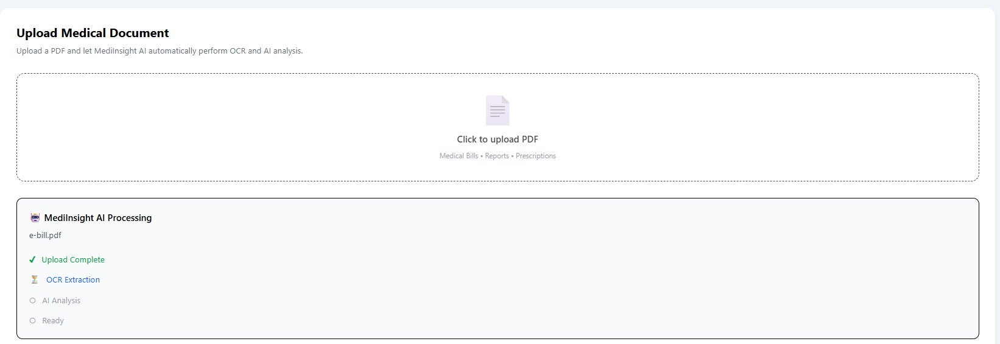
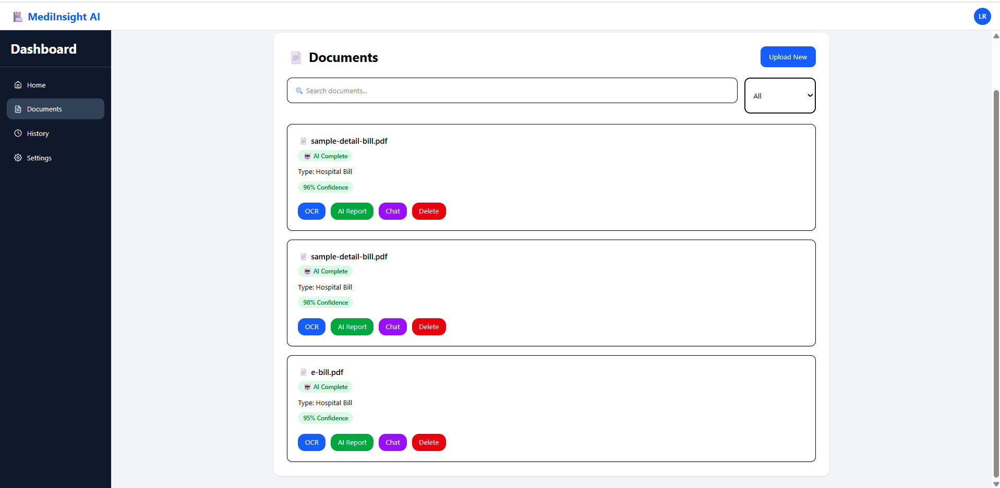
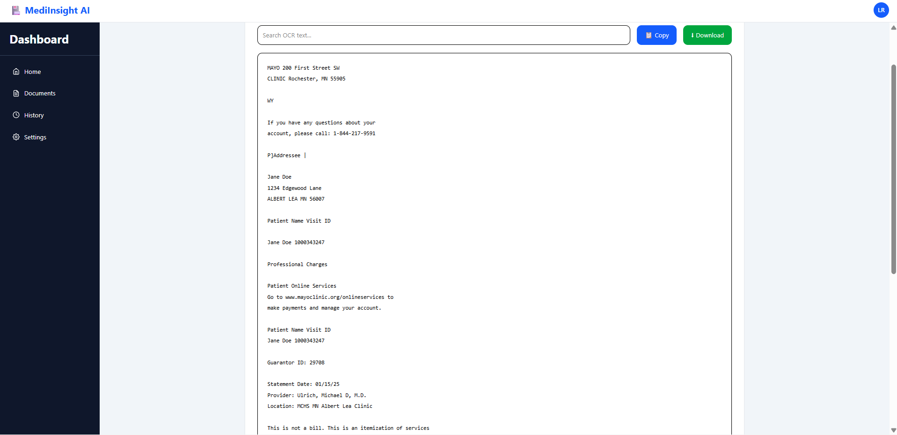
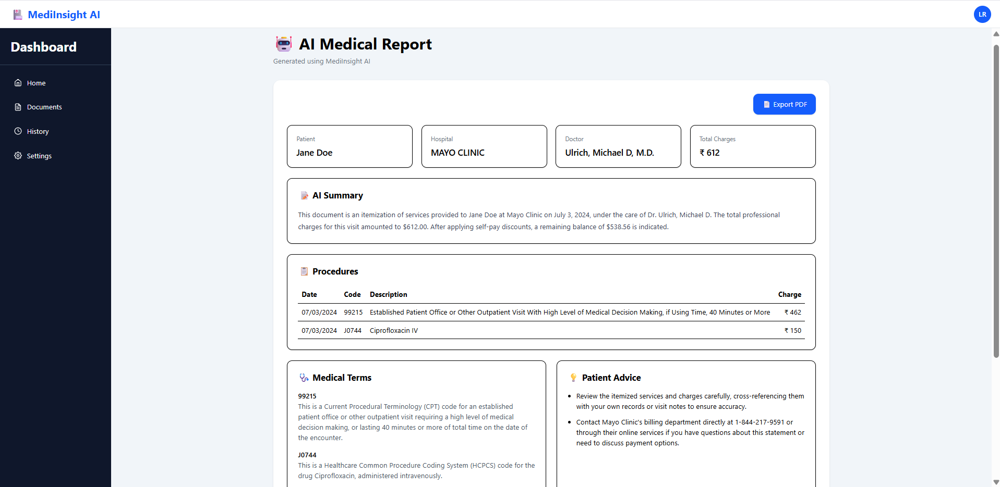
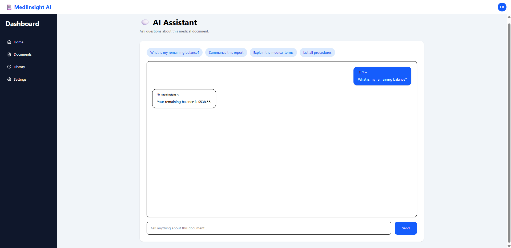

<div align="center">

# 🏥 MediInsight AI

**Turn medical documents into answers — not paperwork.**

Upload a hospital bill, prescription, or lab report and get an instant OCR
extraction, an AI-generated plain-language summary, and a chat assistant
that can answer questions about it — grounded in the document itself.

🔗 **[Live Demo](https://medinsight-ai-tau.vercel.app)** — try it yourself, no setup required

[Features](#-features) · [Architecture](#-architecture) · [Getting Started](#-getting-started) · [Roadmap](#-roadmap)

</div>

---

## 🚧 Project Status: v1.2

Live, end-to-end, deployed. Core pipeline (upload → OCR → AI analysis →
chat), authentication, report versioning, comparison, timeline, and
deployment are all working in production.

| Layer               | Status                     |
|---------------------|-----------------------------|
| Backend API         | ✅ Working                  |
| OCR Pipeline        | ✅ Working                  |
| AI Analysis         | ✅ Working                  |
| RAG-based Chat      | ✅ Working                  |
| Dashboard / UI      | ✅ Working                  |
| Document Comparison | ✅ Working                  |
| Medical Timeline    | ✅ Working                  |
| Dark Mode           | ✅ Working                  |
| Authentication      | ✅ Working                  |
| Report Versioning   | ✅ Working                  |
| Deployment          | ✅ Live (Vercel + Railway)  |
| Cloud File Storage  | 🚧 In progress              |

> **Note:** The backend runs on Railway's free trial tier, so uploaded
> documents and accounts may reset periodically. Feel free to register a
> fresh account to try it out.

---

## ✨ Features

### 🔐 Authentication
- JWT-based register/login, every document scoped to its owner
- Password rules enforced (length, complexity, can't contain your name/email)

### 📄 Document Processing
- PDF upload with validation, hashing, and unique storage
- OCR text extraction (Tesseract + Poppler)
- Persistent document history via SQLite

### 🤖 AI Analysis
- Structured medical report generation: patient, hospital, doctor, procedures, financials
- Plain-language summaries and medical term explanations
- Financial figures cross-validated against OCR text to prevent AI arithmetic drift
- **Version history** — every re-analysis is saved, not overwritten; view or restore any past version

### 💬 AI Chat Assistant
- Retrieval-augmented chat (FAISS + sentence-transformers) grounded in the uploaded document
- Falls back to general medical knowledge when the document doesn't have the answer — clearly labeled
- Multi-provider AI Gateway with automatic failover (see [Architecture](#-architecture))

### 📊 Dashboard & Document Management
- Upload workflow with live processing status
- Search, filter, delete, compare documents, and view a medical timeline
- OCR and AI report viewers, dark mode, mobile-responsive layout
- Export AI report as PDF

---

## 🏗 Architecture
                    React + TypeScript (Vite)
                             │
                             ▼
                FastAPI REST API (JWT auth)
                             │
          ┌──────────────────┼──────────────────┐
          ▼                  ▼                   ▼
      SQLite DB      OCR (Tesseract +      AI Gateway
                      Poppler)             ┌──────────┐
                                            │  Groq    │→ primary
                                            │  Gemini  │→ fallback
                                            │OpenRouter│→ fallback
                                            └──────────┘
                             │
                             ▼
                  FAISS + Sentence-Transformers
                      (RAG for document chat)
                             │
          ┌──────────────────┼──────────────────┐
          ▼                  ▼                   ▼
      OCR Viewer      AI Chat Assistant     PDF Export

**Why an AI Gateway?** Analysis and chat run through a provider-agnostic
interface with automatic failover across Groq, Gemini, and OpenRouter. If
one provider is rate-limited or down, the request transparently retries on
the next.

---

## 🛠 Tech Stack

**Frontend** — React · TypeScript · Tailwind CSS · React Router · Axios · React Hot Toast · jsPDF

**Backend** — FastAPI · SQLAlchemy · SQLite · Pydantic · PyJWT · bcrypt

**AI / OCR** — Groq · Google Gemini 2.5 Flash · OpenRouter · Tesseract OCR · pdf2image / Poppler · FAISS · Sentence-Transformers

**Deployment** — Docker · Railway (backend) · Vercel (frontend)

---

## 📸 Screenshots

| Dashboard | Upload Workflow | Documents |
|---|---|---|
|  |  |  |

| OCR Result | AI Medical Report | Chat Assistant |
|---|---|---|
|  |  |  |

---

## 📁 Project Structure

MediInsight-AI/
├── Dockerfile
├── backend/
│ └── app/
│ ├── ai/ # AI Gateway: provider classes, prompts, response parsing
│ ├── api/ # FastAPI routes (incl. auth, versions)
│ ├── database/ # SQLAlchemy models, CRUD
│ ├── rag/ # Chunking, embeddings, FAISS vector store
│ ├── schemas/ # Pydantic schemas
│ ├── services/ # Business logic (parsing, validation, pipeline)
│ └── utils/ # OCR, security (JWT/bcrypt), storage
├── frontend/
│ └── src/
│ ├── components/ # dashboard, ai, chat, documents, comparison, timeline, auth
│ ├── pages/
│ ├── hooks/ # useAuth, useTheme
│ ├── services/ # API client
│ └── types/
├── requirements.txt
└── frontend/package.json


---

## ⚙️ Getting Started

### Option A: Docker (recommended)
```bash
docker build -t mediinsight-backend .
docker run -p 8000:8000 --env-file backend/.env mediinsight-backend
```

### Option B: Manual

**Prerequisites**: Python 3.10+, Node.js 18+, Tesseract OCR + Poppler on your PATH

```bash
cd backend
python -m venv .venv
.venv\Scripts\activate        # Windows
pip install -r requirements.txt
# Add your API keys + SECRET_KEY to backend/.env (see backend/.env.example)
uvicorn backend.app.main:app --reload
```
Backend: `http://127.0.0.1:8000` · Swagger docs: `http://127.0.0.1:8000/docs`

```bash
cd frontend
npm install
npm run dev
```
Frontend: `http://localhost:5173`

---

## 🗺 Roadmap

**Now**
- [ ] Cloud object storage for uploads (persist across redeploys)
- [ ] Password reset flow

**Later (v2.0)**
- [ ] Doctor / patient dashboards
- [ ] Multi-language OCR
- [ ] Medical image analysis (DICOM support)
- [ ] Voice assistant
- [ ] Hospital integration APIs

---

## 🤝 Contributing

```bash
git checkout -b feature-name
git commit -m "Add feature"
git push origin feature-name
```
Then open a Pull Request.

---

## 👨‍💻 Author

**Lingam Roopesh**
[GitHub](https://github.com/roopesh431) · [LinkedIn](https://linkedin.com/in/lingam-roopesh)

---

## 📄 License

MIT License.

---

<div align="center">

If this project is useful to you, consider giving it a ⭐ on GitHub.

</div>
